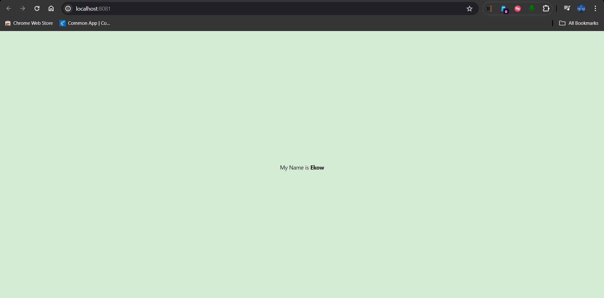

# rn-assignment2-11083926
Assignment 2 for Mobile Dev

## Student ID: 11083926

## Image of Task

## Task Description
For this task, I set the background colour to lemon green.

The task was to creat a react app which I did using 
npx create-expo-app -- template
and then selecting Blank for a js Blank template

I then changed the text from "Open in App.js" to "My Name is Ekow".

Then I added the bold effect after I changed the background.
